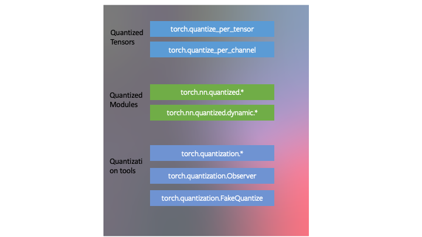

# 量化简介（Eager）

参考：[introduction-to-quantization-on-pytorch](https://pytorch.org/blog/introduction-to-quantization-on-pytorch/)

PyTorch 设计了 {mod}`torch.ao.quantization` 来适应 PyTorch 框架。这意味着：

- PyTorch 具有与 [量化张量](quantized-tensor) 对应的数据类型，它们具有张量的许多特性。
- 可以用量化张量编写内核，就像浮点张量的内核一样，来定制它们的实现。PyTorch 支持 `quantized` 模块，用于通用运算，作为 `torch.nn.quantized` 和 `torch.nn.quantized.dynamic` 名称空间的一部分。
- 量化与 PyTorch 的其余部分兼容：量化模型是 traceable 和 scriptable。对于服务器和移动后端，量化方法实际上是相同的。可以很容易地在模型中混合量化和浮点运算。
- 浮点张量到量化张量的映射可以通过用户定义的 observer/fake-quantization 块进行定制。PyTorch 提供了默认的实现，应该适用于大多数用例。



在 PyTorch 中开发了三种量化神经网络的技术，作为 {mod}`torch.ao.quantization` 中量化工具的一部分。

```{rubric} 动态量化
```

PyTorch 支持的最简单的量化方法称为动态量化（dynamic quantization）。这不仅涉及到将权值转换为 int8（就像所有量化变量中发生的那样），还涉及到在执行计算之前动态地将激活转换为 int8（因此是动态的）。因此，计算将使用高效的 int8 矩阵乘法和卷积实现来执行，从而获得更快的计算速度。但是，激活是用浮点格式读写到内存中的。

在 PyTorch 中有简单的动态量化API `torch.quantization.quantize_dynamic`，它接受模型以及几个其他参数，并生成量化模型。

[端到端教程](https://pytorch.org/tutorials/intermediate/dynamic_quantization_bert_tutorial.html)为 BERT 模型演示了这一点；虽然教程很长，包含了加载预训练模型和其他与量化无关的概念的部分，但量化 BERT 模型的部分很简单。

```python
import torch.quantization
quantized_model = torch.quantization.quantize_dynamic(model, {torch.nn.Linear}, dtype=torch.qint8)
```

```{note}
在我们的教程中有一个端到端示例，请在[这里](https://pytorch.org/tutorials/advanced/dynamic_quantization_tutorial.html)和[这里](https://pytorch.org/tutorials/intermediate/dynamic_quantization_bert_tutorial.html)查看这个函数的文档。
```

```{rubric} 后训练静态量化
```

通过将网络转换为同时使用整数算法和 int8 内存访问，可以进一步提高性能（延迟）。静态量化执行额外的步骤，首先通过网络输入批数据，并计算不同激活的结果分布（具体来说，这是通过在记录这些分布的不同点插入 `observer` 模块来完成的）。这一信息用于确定在推理时应该如何具体地量化不同的激活（一种简单的技术是将整个激活范围简单地划分为 256 个级别，但我们也支持更复杂的方法）。

重要的是，这个额外的步骤允许我们在运算之间传递量化的值，而不是在每个运算之间将这些值转换为浮点数（然后再转换为整数），从而显著提高了速度。

允许用户优化他们的静态量化：

- `Observer`：可以定制观测者模块，该模块指定在量化之前如何收集统计数据，以尝试更高级的方法来量化数据。
- 算子融合：可以将多个算子融合为单个算子，节省内存访问，同时提高运算的数值精度。
- 逐通道量化：可以在卷积/线性层中独立量化每个输出通道的权值，这可以在几乎相同的速度下获得更高的精度。

```{note}
1. 使用 {func}`torch.ao.quantization.fuse_modules` 融合模块：
2. 使用 {func}`torch.quantization.prepare` 插入观测者
3. 最后，量化本身是使用 {func}`torch.ao.quantization.convert` 完成的
```

有包含端到端量化示例的教程（这个教程还介绍了量化感知训练），但是由于 API 很简单，在经过训练的模型 myModel 上执行训练后静态量化的三行代码是：

```python
# set quantization config for server (x86)
deploymentmyModel.qconfig = torch.ao.quantization.get_default_config('fbgemm')

# insert observers
torch.ao.quantization.prepare(myModel, inplace=True)
# Calibrate the model and collect statistics

# convert to quantized version
torch.ao.quantization.convert(myModel, inplace=True)
```

```{rubric} 量化感知训练
```

量化感知训练（Quantization-aware training，简称 QAT）是第三种方法，通常是这三种方法中准确度最高的一种。使用 QAT，所有的权值和激活都在前向和后向训练过程中被伪量化：也就是说，浮点值被舍入以模拟 int8 值，但所有的计算仍然使用浮点数完成。因此，在意识到模型最终将被量化的情况下，对训练过程中的所有权值进行调整；因此，在量化后，该方法通常比其他两种方法获得更高的精度。

1. `torch.ao.quantization.prepare_qat` 插入伪量化模块来建模量化。
2. 模仿静态量化 API，一旦训练完成，`torch.quantization.convert` 为真正的量化模型。

例如，在[端到端示例](https://pytorch.org/tutorials/advanced/static_quantization_tutorial.html)中，我们将预训练的模型作为 `qat_model` 加载进去，然后使用 `qat_model` 执行量化感知训练：

```python
# specify quantization config for QAT
qat_model.qconfig = torch.ao.quantization.get_default_qat_qconfig('fbgemm')

# prepare QAT
torch.ao.quantization.prepare_qat(qat_model, inplace=True)

# convert to quantized version, removing dropout, to check for accuracy on each
epochquantized_model = torch.ao.quantization.convert(qat_model.eval(), inplace=False)
```

## 设备和算子支持

量化支持仅限于可用算子的子集，具体取决于所使用的方法，有关支持算子的列表，请参阅 [文档](https://pytorch.org/docs/stable/quantization.html)。

可用算子和量化数值的集合也取决于用于运行量化模型的后端。目前，量化算子仅支持以下后端 CPU 推理：x86 和 ARM。两个量化配置（如何量化张量和量化内核（量化张量的算法）都是后端依赖的）。可以通过执行来指定后端：

```python
import torch
backend='fbgemm'
# 'fbgemm' for server, 'qnnpack' for mobile
my_model.qconfig = torch.ao.quantization.get_default_qconfig(backend)
# prepare and convert model
# Set the backend on which the quantized kernels need to be run
torch.backends.quantized.engine=backend
```

然而，量化感知训练发生在全浮点，可以在 GPU 或 CPU 上运行。量化感知训练通常只在训练后的静态或动态量化不能产生足够的准确性时使用 CNN 模型。这可能发生在高度优化以实现小尺寸的模型（如 Mobilenet）上。

## 小结

目前，算子的覆盖范围是有限的，可能会限制下表中列出的选择：下表提供了一个指导原则。

Model Type	|Preferred scheme	|Why
:-|:-|:-
LSTM/RNN	|Dynamic Quantization	|Throughput dominated by compute/memory bandwidth for weights
BERT/Transformer	|Dynamic Quantization	|Throughput dominated by compute/memory bandwidth for weights
CNN	|Static Quantization	|Throughput limited by memory bandwidth for activations
CNN	|Quantization Aware Training	|In the case where accuracy can't be achieved with static quantization